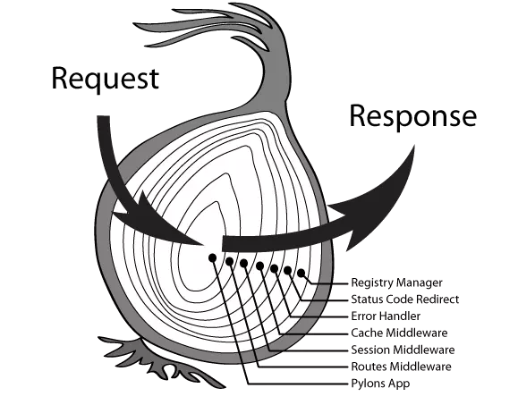
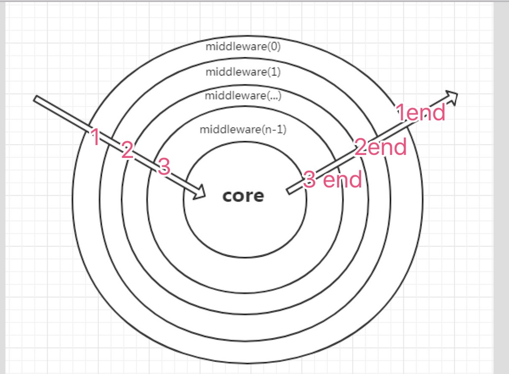

# Koa中间件（middleware）实现探索

##### 首先用一段简单的代码了解一下中间件执行顺序。

```javaScript
const Koa = require('koa')
const app = new Koa()

app.use(async function m1(ctx, next) {
  console.log('1')
  await next();
  console.log('1 end')
})

app.use(async function m2(ctx, next) {
  console.log('2')
  await next();
  console.log('2 end')
})

app.use(async function m3(ctx, next) {
  console.log('3')
  ctx.body = 'Hello World'
  console.log('3 end')
})

app.listen(3000);
```

##### koa通过compose方法把中间件封装成一个promise对象，然后递归执行。使P中间件数组变成洋葱圈，能递归线性处理上下文。

##### 下面是官方的配图


#### 我们主要看一下这个库

```javascript
function compose (middleware) {
  return function (context, next) {
    let index = -1
    return dispatch(0)
    function dispatch (i) {
      if (i <= index) return Promise.reject(new Error('next() called multiple times'))
      index = i
      let fn = middleware[i]
      if (i === middleware.length) fn = next
      if (!fn) return Promise.resolve()
      try {
        return Promise.resolve(fn(context, dispatch.bind(null, i + 1)));
      } catch (err) {
        return Promise.reject(err)
      }
    }
  }
}

//通过调用第一个函数,层层递归调用，然后达到洋葱模型

/**
* function(){
	return dispatch(i+1)
}
*/
```



###### 这里的 Promise.resolve(fn(..)) 帮助我们异步执行的中间件函数，这里的next函数就解释了为什么Koa的中间件调用是递归执行的，它递归调用了 dispatch 函数来遍历数组中的，同时，所有的中间件函数享有同一个 ctx


#### 然后我根据compose处理后的中间件，大致中间件执行中理想的样子如图下


```javaScript
(async function(){
    // middleware1
	console.log('1');
    await  (async function(){
        // middleware2
        console.log('2');
        await ( async function(){
            // middleware3
            ...
            console.log('3');
            console.log('3 end');
            // ...middleware3
        })
        console.log('2 end')
        // ...middleware2
    })
    console.log('1 end');
    // ...middleware1
})()

```

```javaScript
return fn(ctx).then(handleResponse).catch(onerror)。
来看看这一句，fn 之前说过了，是所有的中间件函数的 “集合”， 用这一个中间件来表示整个处理过程。
同时 fn 也是一个 async 函数，执行结果返回一个 promise 对象，
同时 handleResponse 作为其 resolved 函数，onerror 是 rejected 函数。
```